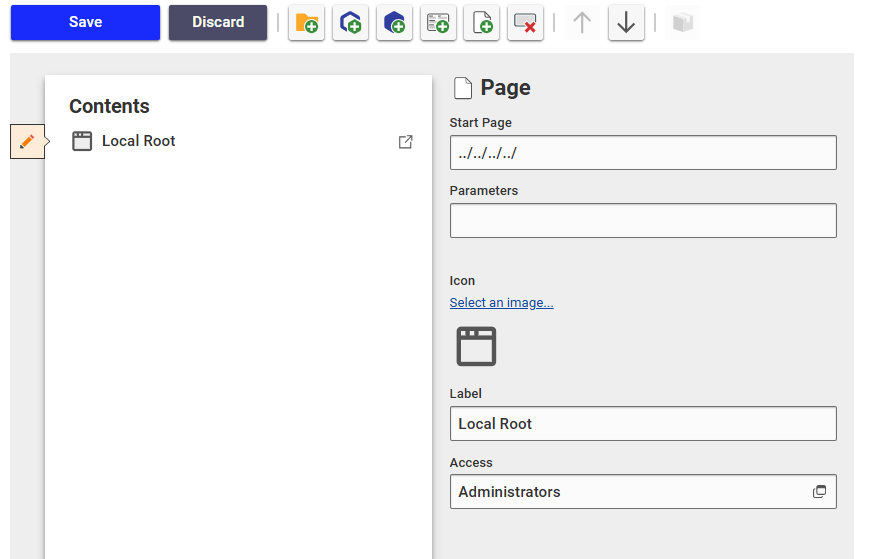

# Aras Lib Example App

🚀 A simple example and step-by-step guide to getting started with **Aras-Lib**.

This template is built with **TypeScript, React, and Vite** for a seamless development experience.

## 📦 Installation

To install dependencies, run the following command:

```bash
npm install
```

## 🔧 Usage

### 1️⃣ Configure Aras OAuth

To enable authentication, add `localhost:3000` to the allowed redirect URIs in your **Aras Innovator OAuth Configuration**.

Add the following lines to **OAuth.config** located at:
`C:\Program Files (x86)\Aras\Innovator\OAuthServer`

```xml
<!-- Aras Lib Config -->
<redirectUri value='https://localhost:3000/InnovatorServer/Client/OAuth/RedirectCallback' />
<redirectUri value='https://localhost:3000/InnovatorServer/Client/OAuth/SilentCallback' />
<redirectUri value='https://localhost:3000/InnovatorServer/Client/OAuth/PopupCallback' />
<!-- Aras Lib Config -->
```

### 2️⃣ Configure Application

Update `app.config.ts` with your Aras Innovator settings.

```typescript
// Application configuration
export const appConfig = {};

// Vite configuration
export const viteConfig = {
  // Enable Tailwind CSS V4
  useTailwind: true,

  // Port for Vite development server
  port: 3000,

  // Proxy settings for Innovator Server
  arasProxy: {
    server: "https://aras.example.com/innovatorserver",
    useSSL: true,
    openArasOnStart: true,
  },
};
```

### 3️⃣ Add to TOC

To add the application to the **Table of Contents (TOC)**:

1. Open **Aras Innovator**.
2. Navigate to **TOC → Administration → Configuration → TOC Editor**.
3. Add a new page as shown below:

   

## 🚀 Start Application

Run the following command to start the demo application:

```bash
npm run dev
```

This will open **Aras Innovator** in your browser via a localhost proxy.

Navigate to the page you created earlier to access the application.

## 📜 License

This project is licensed under the **MIT License**.
